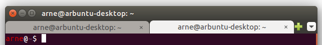
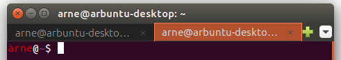

# Ubuntu terminal appearance

On Ubuntu, to change appearance of the terminal:

1. Edit the file `~/.config/gtk-3.0/gtk.css`
2. Close all terminal windows and reopen

The styles in [gtk.css](gtk.css) changes the appearance of
the tabs, and makes the active tab stand out with an orange
color.

*Above:* Default tab style, Ubuntu 16.04

*Above:* Custom style, from applying this [gtk.css](gtk.css)

